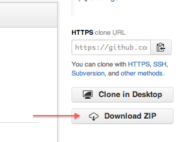

# An Introduction to R for Ecologists
## Workshop to be held at ESA 2016 in Fort Lauderdale

Welcome to the GitHub repository for the Introduction to R for
Ecologists workshop to be held at ESA 2016 in Fort Lauderdale

**Location and time:** 
Saturday, 6 August 2015    
8:00 AM - 11:30 AM    
Location: 203, Ft Lauderdale Convention Center  

## Organizers
[Andrew MacDonald](http://www.zoology.ubc.ca/~macdonald/curious_interactions/), [Naupaka Zimmerman](http://naupaka.net), [Andrew Tredennick](atredennick.github.io ), and [Noam Ross](http://www.noamross.net/).

---
Many ecologists have started using the R statistical programming
language to facilitate data analysis and visualization for their
research. It is popular both because of its power and flexibility, but
also because it makes it easier to produce analyses that are
well-documented and reproducible. Plus, and perhaps best of all, it’s
completely free! This workshop is meant for total beginners (of all
        career stages), who may have heard of R but never used it
themselves, or for those who have just started using R but want a more
formal introduction to the programming environment and to some general
best practices. We will cover loading data, calculating basic
statistics, and making plots. We will also highlight best practices for
scientific computing along the way, including how to set up a directory
structure that makes sense for code-driven analyses and writing
well-commented, well-structured code. We will introduce the RStudio
software environment and point out the benefits of using it to
facilitate script writing. All participants must bring their own laptop
with R and RStudio (available free online for all platforms at
        rstudio.com) pre-installed. 

---

## Pre workshop instructions

### Installing R  
If you don't already have R set up with a suitable code editor, we
recommend downloading and installing [R](http://cran.cnr.berkeley.edu)
and [RStudio Desktop](http://www.rstudio.com/ide/download/) for your
platform. Once installed, open RStudio check to make sure you are running the newest version of R (3.3.1) and that you don't get any error messages. 

### Downloading code/data from this repository  
If you're already familiar with `Git`, then simply clone this repo. If
you're not familiar with Git, simply hit the **Download ZIP** button on
the right side of this page. If you're not sure where to save it, just
download and unzip to your Desktop.

* Please wait until Friday afternoon to this so you are able to
download the latest changes. Otherwise do another git pull or replace
your downloaded copy with a newer one.*

If you're having any trouble with these steps please drop us an
[email](mailto:naupaka@gmail.com). We'll also strive to have local
copies if you forget to install any of these tools.

See you Saturday!

---

These materials are all based on those created by the [Data
Carpentry](http://www.datacarpentry.org) organization and are Copyright (c)
Data Carpentry. They are licensed under a Creative Commons Attribution
license. See the `LICENSE.md` file for further details. You can access
[the original repository
here](https://github.com/datacarpentry/R-ecology). 

